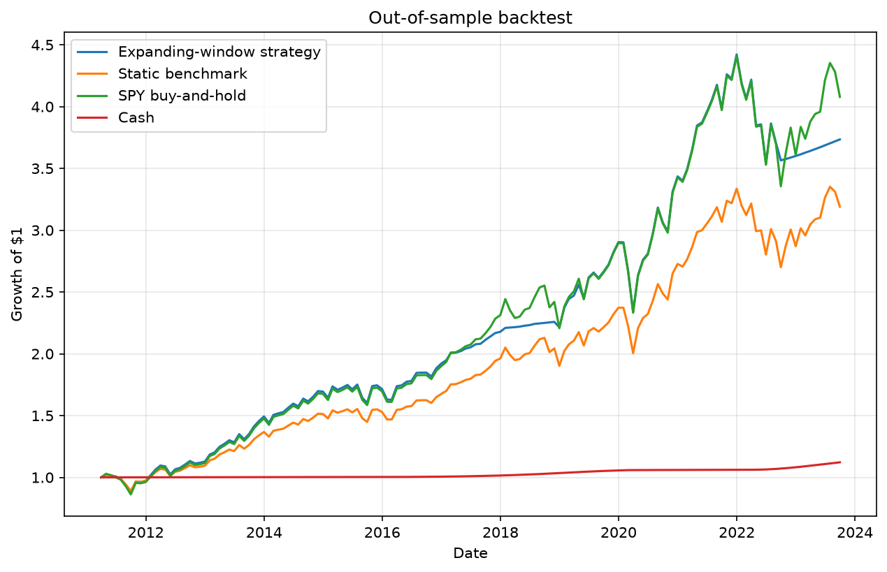
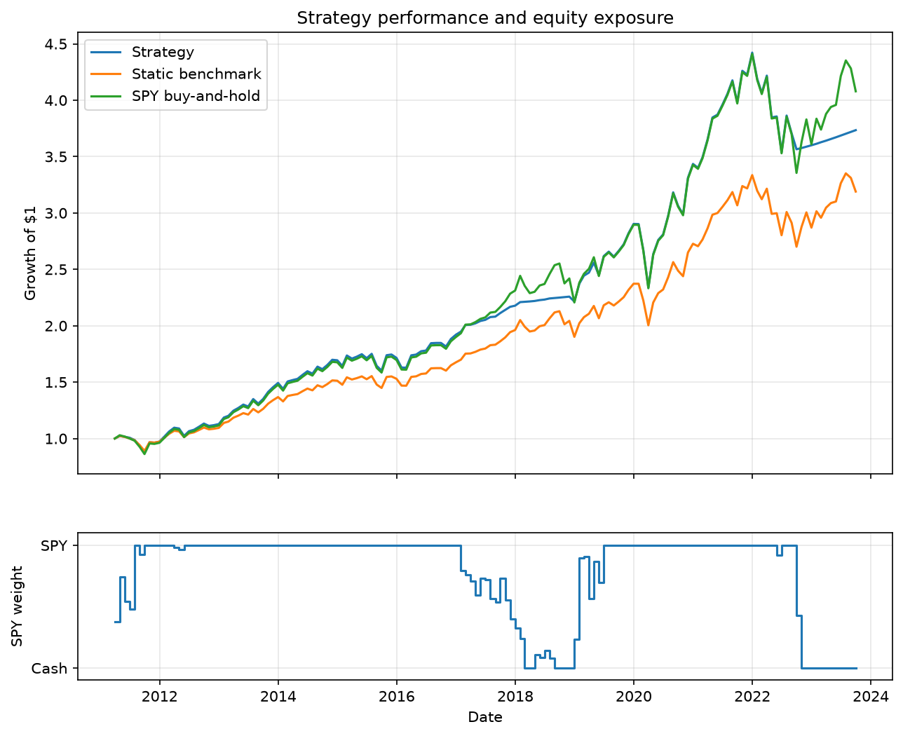

# Valuation-Aware Equity Allocation

A research project that tests whether equity valuation and interest rates can improve tactical allocation between the S&P 500 and cash.

The project estimates expected 12-month equity returns from the Shiller CAPE earnings yield and the US 10-year Treasury yield. It then uses an expanding-window backtest to determine the monthly allocation to SPY and 3-month Treasury bills.

> This is an educational research project, not investment advice or a production trading strategy.

## Research question

Can the relative attractiveness of equities and bonds, measured through valuation and interest rates, improve risk-adjusted returns compared with:

- a 100% SPY buy-and-hold portfolio;
- a static SPY/cash portfolio with the same average equity exposure?

The underlying intuition is that equities should offer more attractive future returns when their earnings yield is high relative to bond yields.

## Methodology

### Data

The dataset combines monthly observations for:

- SPY adjusted prices and total returns, downloaded with `yfinance`;
- US 10-year Treasury yield (`DGS10`) from FRED;
- 3-month Treasury bill yield (`TB3MS`) from FRED;
- S&P Composite price, earnings and CAPE ratio from Robert Shiller's *Irrational Exuberance* dataset.

The usable valuation sample runs from January 2000 to September 2023.

### Predictive model

Each month, the model estimates the following regression using only information that would have been available at that point in time:

$$R^{\mathrm{SPY}}_{t \rightarrow t+12} = \alpha + \beta_1 \left(\frac{1}{\mathrm{CAPE}_t}\right) + \beta_2 y^{10Y}_t + \varepsilon_t$$

where:

- $R^{\mathrm{SPY}}_{t \rightarrow t+12}$ is the SPY total return over the following 12 months;
- $\frac{1}{\mathrm{CAPE}_t}$ is the CAPE earnings yield;
- $y^{10Y}_t$ is the US 10-year Treasury yield.

The model is re-estimated every month using an expanding window. To avoid look-ahead bias, a 12-month return observation enters the training set only after its full return horizon has elapsed.

### Allocation rule

The predicted 12-month SPY return is compared with the current 3-month Treasury bill yield.

The baseline gradual allocation rule is:

$$w_t = \min\left(1,\max\left(0,\frac{\widehat{R}^{\mathrm{SPY}}_{t \rightarrow t+12} - y^{\mathrm{cash}}_t}{5\%}\right)\right)$$

where $w_t$ is the SPY weight for the following month.

- An expected excess return of 0% implies a 0% allocation to SPY.
- An expected excess return of 2.5% implies a 50% allocation.
- An expected excess return of at least 5% implies a 100% allocation.

The portfolio is invested in cash for the residual weight. Signals are implemented with a one-month lag.

## Results

### Out-of-sample backtest

The expanding-window backtest runs from March 2011 to September 2023.

| Portfolio | Annualized return | Annualized volatility | Sharpe ratio | Maximum drawdown |
|---|---:|---:|---:|---:|
| Valuation-aware strategy | 11.04% | 12.70% | 0.82 | -19.99% |
| Static benchmark with same average SPY weight | 9.66% | 11.46% | 0.78 | -19.04% |
| SPY buy-and-hold | 11.82% | 14.47% | 0.78 | -23.93% |

### Equity curve



The strategy held an average SPY weight of 79.2%.

The result suggests that the timing signal added value relative to a static portfolio with the same average equity exposure. It did not outperform 100% SPY in total return, but it achieved a higher Sharpe ratio and a smaller maximum drawdown.

### Dynamic allocation



### Robustness checks

The project includes:

- an expanding-window backtest to reduce look-ahead bias;
- comparisons with both SPY buy-and-hold and a matched-exposure static benchmark;
- subperiod analysis across 2011–2016, 2017–2019 and 2020–2023;
- transaction-cost sensitivity at 0, 5 and 10 basis points per dollar traded;
- allocation-scale sensitivity at 3%, 5%, 7% and 10%.

The strategy outperformed the matched-exposure static benchmark across all tested allocation scales. It remained ahead after applying 5 and 10 basis points of transaction costs.

## Key findings

- CAPE earnings yield and Treasury yields have predictive content for subsequent 12-month SPY returns in the sample.
- A binary all-equity/all-cash rule was not compelling.
- A gradual allocation rule improved risk-adjusted performance relative to a static portfolio with the same average SPY exposure.
- The strategy performed particularly well in 2017–2019 but underperformed the matched static benchmark in 2020–2023.
- The model should be interpreted as a valuation-aware allocation overlay, not as a reliable crash-protection signal.

## Limitations

Several limitations are important:

- The Shiller dataset is not a fully point-in-time vintage database. Historical revisions and publication timing may affect real-time implementability.
- The project uses a single market, the United States, and a relatively short modern out-of-sample period.
- The allocation rule and its parameters were developed after inspecting the historical dataset. The reported backtest is therefore not a fully independent final validation.
- The strategy ignores taxes, fund management fees, market impact and operational constraints.
- CAPE is a slow-moving valuation measure and is not designed to time short-term market shocks.

## Project structure

```text
data/
    market_data_monthly.csv
    shiller_valuation_monthly.csv
    research_dataset_monthly.csv

src/
    download_data.py
    add_cash_rate.py
    download_valuation_data.py
    build_research_dataset.py
    analyze_predictive_power.py
    backtest_expanding_window.py
    backtest_gradual_allocation.py
    analyze_subperiods.py
    analyze_transaction_costs.py
    analyze_scale_sensitivity.py

outputs/
    backtest charts and CSV result files
```

## Reproducing the analysis

Create and activate the virtual environment:

```bash
python3.13 -m venv .venv313
source .venv313/bin/activate
```

Install dependencies:

```bash
python -m pip install pandas numpy matplotlib yfinance statsmodels fredapi xlrd
```

Run the scripts in this order:

```bash
python src/download_data.py
python src/add_cash_rate.py
python src/download_valuation_data.py
python src/build_research_dataset.py
python src/analyze_predictive_power.py
python src/backtest_expanding_window.py
python src/backtest_gradual_allocation.py
python src/analyze_subperiods.py
python src/analyze_transaction_costs.py
python src/analyze_scale_sensitivity.py
```

## Data sources

- Robert J. Shiller, *U.S. Stock Markets 1871-Present and CAPE Ratio*
- Federal Reserve Economic Data (FRED)
- Yahoo Finance, accessed through `yfinance`